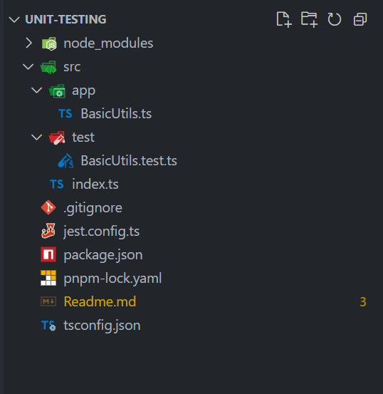
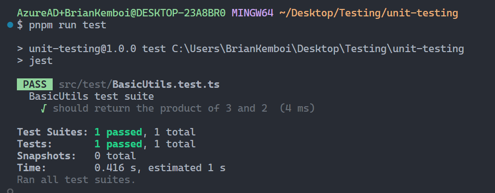
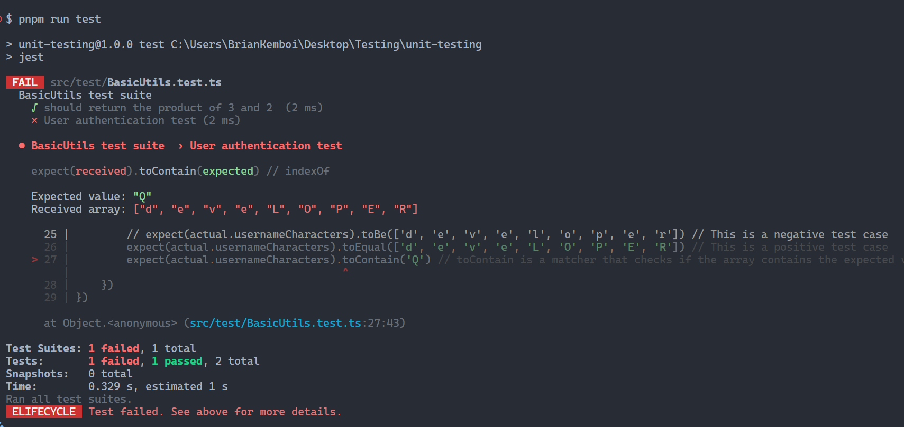
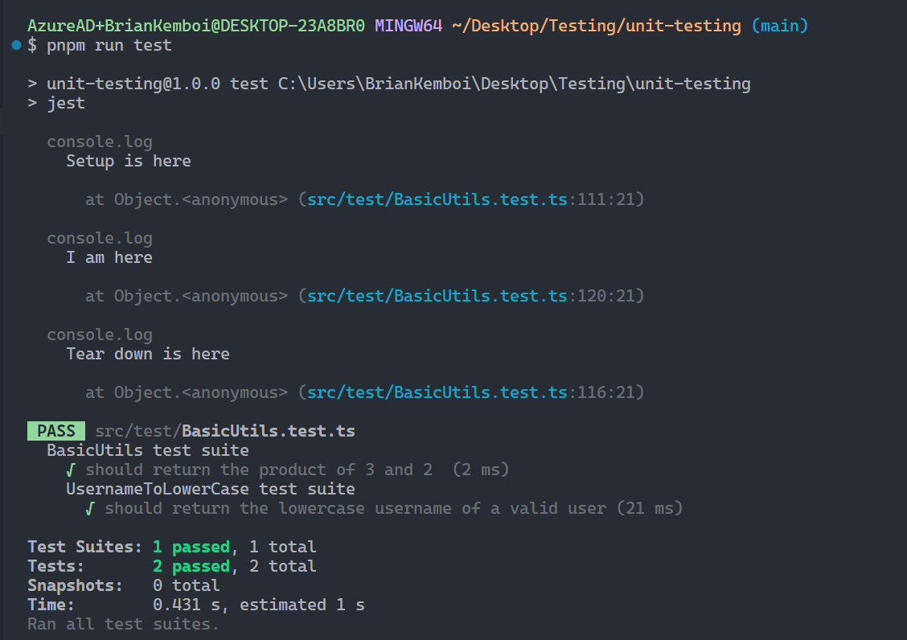
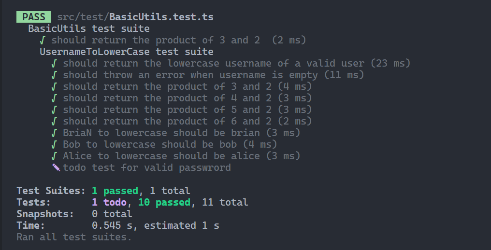
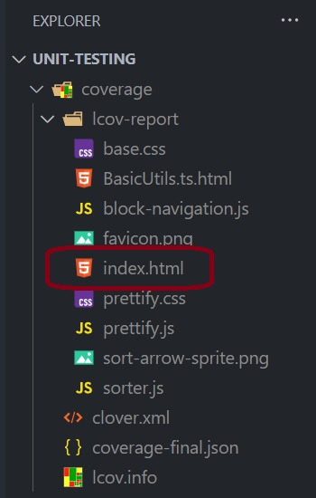
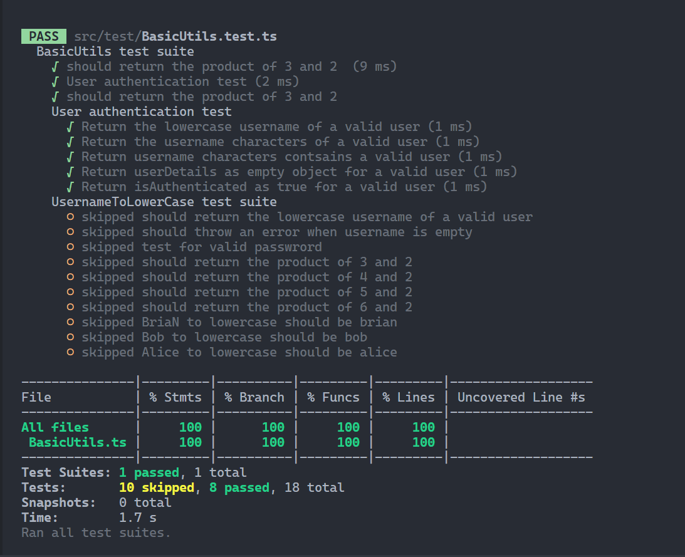
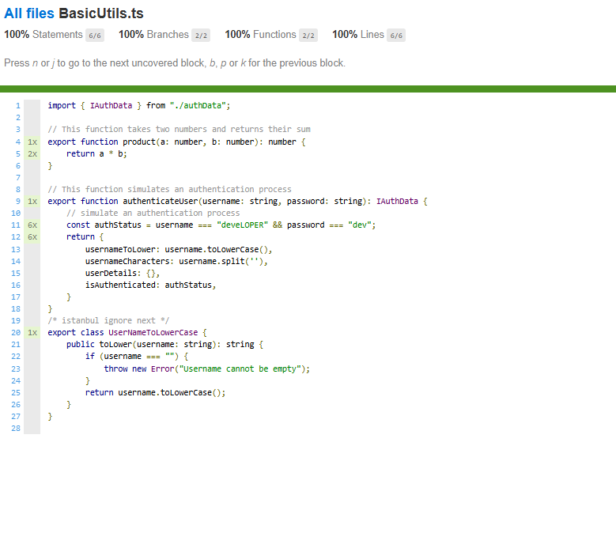

# Unit Testing with JEST

## What is Software Testing

The process of Evaluating and conforming thar our application does what it is supposed to do

### Why do we need to Test?

* To prevent Bugs
* Improve Perfomance
* Reduce Development cost
* Reliability and customer satisfaction

### Types of Tests

* Unit Test: Testing Individual units of source code.i.e function, method, object, module ....
* Intergration Test: Combines different units..
* End-to-End Test:  Involves replicating end user behaviour

## What is JEST

Jest is a JavaScript framework. It works with project using TypeScript, Node, Angular, React.....

It was created by Facebook to help test JavaScript code

[Link to the official documentation](https://jestjs.io/docs/getting-started "visit the link")

* Most popular and most supported
* It is all in one solution
* It is a test runner and also an assertion library that gives us powerful set of Matchers,

### Intro to Unit Test

#### *step 1. Setup Your Project with TypeScript*

use the Readme.md on GitHub to setup typescript project: [link to the repo](https://github.com/Teach2Give-Training-Resources/Setup-TypeScript-with-tsx "click on the link")

#### *step 2: Install Jest with additional dependencies*

pnpm i -D jest ts-jest @types/jest ts-node

**Description:**

**ts-jest -** It integrates seamlessly with Jest, making it easier to run tests on TypeScript code without needing additional transpilation steps.

**@types/jest** - When you're using Jest with TypeScript, the `@types/jest` package provides type definitions that help TypeScript understand Jest's testing functions, like `describe`, `test`, and `expect`.

ts-node- *we need ts-node for code transpilation from typescript to javascript. TSX helps us run typescript/jsx code but does not give a runtime environment that understands typescript.*

#### *step 3: Create a jest config file*

on the root dir, create a file with the name: ***jest.config.ts***

Add the following code in the created file:

```ts
import type {Config} from 'jest';

const config: Config = {
  preset: "ts-jest",
  testEnvironment: "node",
  verbose: true,
};

export default config;
```

This will create jest.config.js, It allows developers to customize Jest's behavior by specifying various settings, such as test environment, coverage collection, module resolution, and more.

#### *step 4: Create src folder and add **app** and **test***

Attached is a screenshot of how your folder structure should look like.



#### step 5: Running our first test ur first test

* Create a file: ***BasicUtils.ts*** inside app folder and add the following code.

```ts
export function product(a: number, b: number): number {
    return a * b;
}
```

* Create a file: ***BasicUtils.test.ts*** inside test folder and add the following code.

```ts
import { product } from "../app/BasicUtils"

describe("BasicUtils test suite ", () => {
    it("should return the product of 3 and 2 ", () => {
        const actual = product(3, 2)
        expect(actual).toBe(6)
    })
})
```

Add test script on package.json file

```json
{
  "name": "unit-testing",
  "version": "1.0.0",
  "description": "",
  "main": "index.js",
  "scripts": {
    "dev": "tsx watch src/index.ts",
    "build": "tsc",
    "start": "npm run build && node dist/index.js",
    "test": "jest"
  },
  "keywords": [],
  "author": "",
  "license": "ISC",
  "packageManager": "pnpm@10.11.0",
  "devDependencies": {
    "ts-node": "^10.9.2",
    "tsx": "^4.19.4",
    "typescript": "^5.8.3"
  },
  "dependencies": {
    "@types/jest": "^29.5.14",
    "jest": "^29.7.0",
    "ts-jest": "^29.3.4"
  }
}

```

Open your terminal and run the following command:

`pnpm run test`

You should have the following on your terminal:



Congratulations you written your first test with Jest

## Matchers

Definition:

```ts
it("should return the product of 3 and 2 ", () => {
        const actual = product(3, 2)
        expect(actual).toBe(6)
        expect(actual).not.toBe(5) // This is a negative test case
        expect(actual).toEqual(6) // This is a positive test case
        expect(actual).toBeLessThan(10) // toBeLessThan is a matcher that checks if the value is less than the expected value
        expect(actual).toBeLessThanOrEqual(6) // toBeLessThanOrEqual is a matcher that checks if the value is less than or equal to the expected value
        expect(actual).toBeGreaterThan(5) // This is a positive test case
        expect(actual).toBeGreaterThanOrEqual(6) // This is a positive test case
        expect(actual).toBeCloseTo(6.0) // This is a positive test case
    })
```

## Properly Written Unit Test

A well written unit test should undergo the AAA phases

A - Arrange: Initializes a small piece of an application it wants to test (SUT)

A- Act: Applies some stimulus

A- Assert: Observes the resulting behaviour

### Demo

Create an Interface ***authData.ts*** under app directory

```ts
export interface IAuthData {
    usernameToLower: string;
    usernameCharacters: string[];
    userDetails: Object | undefined;
    isAuthenticated: boolean;
}
```

Under ***BasicUtils.ts*** add the following function

```ts
// This function simulates an authentication process
export function authenticateUser(username: string, password: string): IAuthData {
    // simulate an authentication process
    const authStatus = username === "deveLOPER" && password === "dev";
    return {
        usernameToLower: username.toLowerCase(),
        usernameCharacters: username.split(''),
        userDetails: {},
        isAuthenticated: authStatus,
    }
}
```

Write a test for to simulate user login process

```ts
import { authenticateUser, product } from "../app/BasicUtils"

describe("BasicUtils test suite ", () => {
    it("should return the product of 3 and 2 ", () => {
        const actual = product(3, 2)
        expect(actual).toBe(6)
    })

    // step 2:  if any of the above test cases fail, it will show the error message in the console and the test will fail
    it('User authentication test', () => {
        // Arrange
        const sut = authenticateUser // System Under Test
        // Act
        const actual = sut("deveLOPER", "dev") // System Under Test
        // Assert
        expect(actual.usernameToLower).toBe("developer")
        //    Arrays (tobe) will fail because an array is a reference type whereas string is a value type, toBe will only work for primitive types
        // expect(actual.usernameCharacters).toBe(['d', 'e', 'v', 'e', 'l', 'o', 'p', 'e', 'r']) // This is a negative test case
        expect(actual.usernameCharacters).toEqual(['d', 'e', 'v', 'e', 'L', 'O', 'P', 'E', 'R']) // This is a positive test case
        expect(actual.usernameCharacters).toContain('Q') // toContain is a matcher that checks if the array contains the expected value
    })
})
```

With the above demo, you have known how to write a proper test using AAA phases.

## NOTE ‼️‼️

We are not yet there yet, while using the above way to write our tests, we are not separating tests. Whenever a matcher fails, the entire test will fail and this is not the best practice. Therefore, we need to understand the FIRST-U Principle

`       expect(actual.usernameCharacters).toContain('Q')`

This line makes the test fail and the entire test registers a fail



* Some Hacks is using ***it.only*** to skip running other tests

## FIRST-U Principle

To write a good unit test, we should apply the FIRST-U

1. F - Fast: Unit test should be fast
2. I - Independent: Should not depend on other test cases
3. R - Repeatable: should produce the same result each time you run it
4. S - Self-validating: determine if the actual output is according to the expected. No manual interpretation
5. T - Timely: It can be written anytime but TDD is a good practice
6. U - Understandable: clear and easy to understand

***Make the following changes on BasicUtils.test.ts***

```ts
import { authenticateUser, product } from "../app/BasicUtils"

// 😁😁 A better way but not yet

describe("BasicUtils test suite ", () => {
    it("should return the product of 3 and 2 ", () => {
        const actual = product(3, 2)
        expect(actual).toBe(6)
    })

    // TODO - Add a describe here - added only for testing
    describe.only('User authentication test', () => {

        it("Return the lowercase username of a valid user", () => {
            // Arrange
            const sut = authenticateUser // System Under Test
            // Act
            const actual = sut("deveLOPER", "dev") // System Under Test
            // Assert
            expect(actual.usernameToLower).toBe("developer")
        });

        it("Return the username characters of a valid user", () => {
            // Arrange
            const sut = authenticateUser // System Under Test
            // Act
            const actual = sut("deveLOPER", "dev") // System Under Test
            // Assert
            expect(actual.usernameCharacters).toEqual(['d', 'e', 'v', 'e', 'L', 'O', 'P', 'E', 'R'])
        });

        // what is a user enters -   'L', 'O', 'P', 'E', 'R', 'd', 'e', 'v', 'e',,
        it("Return username characters contsains a valid user", () => {
            // Arrange
            const sut = authenticateUser // System Under Test
            // Act
            const actual = sut("deveLOPER", "dev") // System Under Test
            // Assert
            expect(actual.usernameCharacters).toEqual(
                expect.arrayContaining(['L', 'O', 'P', 'E', 'R', 'd', 'e', 'v', 'e']));
        });

        // more matchers
        it("Return userDetails as empty object for a valid user", () => {
            // Arrange
            const sut = authenticateUser // System Under Test
            // Act
            const actual = sut("deveLOPER", "dev") // System Under Test
            // Assert
            expect(actual.userDetails).toEqual({}) // This is a positive test case
            expect(actual.isAuthenticated).toBeDefined()
            expect(actual.isAuthenticated).not.toBeUndefined()
            expect(actual.isAuthenticated).toBeTruthy() // This is a positive test case
            expect(actual.isAuthenticated).not.toBeFalsy() // This is a positive test case
        });
        // Truthy and Falsy
        it("Return isAuthenticated as true for a valid user", () => {
            // Arrange
            const sut = authenticateUser // System Under Test
            // Act
            const actual = sut("deveLOPER", "dev") // System Under Test
            // Assert
            expect(actual.isAuthenticated).toBeTruthy() // This is a positive test case
            expect(actual.isAuthenticated).not.toBeFalsy() // This is a positive test case
        });
    })
})
```

## JEST hooks

Setup and Tear Down are the most common hooks.

Setup runs before a test runs example:

```ts
// setup 
beforeEach(() => {
            console.log("Setup is here");
        })
```

Teardown runs after a test is complete

```ts
// teardown
        afterEach(() => {
            console.log("Tear down is here");
        })

```

Illustration, write another describe in ***BasicUtils.test.ts***

```ts
  describe("UsernameToLowerCase test suite ", () => {
        // setup 
        let sut: UserNameToLowerCase
        beforeEach(() => {
            console.log("Setup is here");
            sut = new UserNameToLowerCase()
        })
        // teardown
        afterEach(() => {
            console.log("Tear down is here");
        })

        it("should return the lowercase username of a valid user", () => {
            const actual = sut.toLower("Bob");
            console.log("I am here");
            expect(actual).toBe("bob")
        })
    })
```

The output of the above hooks simulates how we can write test without having to repeat outselves. We shall use ***aftereach* **hook when we shall be interacting with the database



### Using the Hooks, lets test for an Error

Create a class **UserNameToLowerCase** in ***BasicUtils.ts***

```ts
export class UserNameToLowerCase {
    public toLower(username: string): string {
        if (username === "") {
            throw new Error("Username cannot be empty");
        }
        return username.toLowerCase();
    }
}
```

Write a test to test the suite of converting a username to lowercase in ***BasicUtils.test.ts***

```ts
    describe("UsernameToLowerCase test suite ", () => {
        // setup 
        let sut: UserNameToLowerCase
        beforeEach(() => {
            console.log("Setup is here");
            sut = new UserNameToLowerCase()
        })

        it("should return the lowercase username of a valid user", () => {
            const actual = sut.toLower("Bob");
            console.log("I am here");
            expect(actual).toBe("bob")
        })

        it('should throw an error when username is empty', () => {
            expect(() => {
                sut.toLower("")
            }).toThrow("Username cannot be empty")

            // or
            expect(() => sut.toLower("")).toThrow()
        })
    })
```

* describe.only - will run only this test case
* describe.skip - will skip this test case
* it.only - will run only this test case
* it.skip - will skip this test case
* it.todo - will create a test case but not run it
* fit (only)- will run only this test case, works with describe and it meaning it will run only this test case
* xit - will skip this test case. works with describe and it meaning it will skip this test case

## Parameterized Testing

Assuming that you want to test more than one input, it will be tiresome to repeat the test manually. For this, Parameterized testing will help.

```ts
 it.each([
            [3, 2, 6],
            [4, 2, 8],
            [5, 2, 10],
            [6, 2, 12],
        ])("should return the product of %i and %i", (a: number, b: number, expected: number) => {
            const actual = product(a, b)
            expect(actual).toBe(expected)
        })
```

Parameterized Strings

Write the Parameterized  String Test

```ts
it.each([
            { input: 'BriaN', expected: 'brian' },
            { input: 'Bob', expected: 'bob' },
            { input: 'Alice', expected: 'alice' },
        ])('$input to lowercase should be $expected', ({ input, expected }) => {
            const actual = sut.toLower(input)
            expect(actual).toBe(expected)
        })
```

Whenever you run your code, you should expect such an output:



## Coverage

Used to report the percentage of lines your code was tested


Use the following comment to skip test on most common functions

```
/* istanbul ignore next */
```

The generated coverage has index.html file with the test report.



Coverage report on the terminal



Detailed coverage report on the webpage


